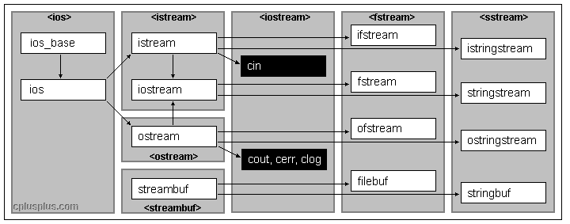

# cplusplus

## io库



iostream  处理完成控制台的IO

fstream 处理命名文件的IO

stringstream完成内存string的IO

```c++
ifstream in(ifile); // 调用ifstream的构造函数并打开给定文件  调用open
				    // 对象的作用域结束会调用析构函数 调用close 
ofstream out; // 输出文件流
```


## 文件的模式：

in 	   		以读的方式打开

out 			以写的方式打开 

app			每次写操作前均定位到文件末尾 

ate			  打开文件后立即定位到文件末尾 all

trunc	      截断文件 

binary	     以二进制方式进行io all

只有针对 ofstream和fstream才可以设置out模式；

只有针对 ifstream和fstream才可以设置in模式；

只有当out也被设定时才可以设定trunc模式；

只要trunc没被设定 就可以设定app，在app模式下即便没有显示指定out模式，文件也总是以输出方式被打开；

默认情况下，即便我们没有指定trunc，以out模式打开的文件也总会被截断，为了保护以out模式打开的文件的内容，我们必须同时指定app模式，这样只会把数据追加到文件末尾；


```c++
// 以out模式打开文件会丢弃已有数据
ofstream out("file1"); // 隐式以输出模式打开文件并截断文件
ofstream out1("file1", ofstream::out); // 隐式截断文件
ofstream out2("file2", ofstream::out | ofstream::trunc); // 显示
// 为了保留文件内容，我们必须用显示指定app模式
ofstream out2("file2", ofstream::app); // 显示
ofstream out2("file2", ofstream::out | ofstream::app); // 显示

// 每次调用open时都会确认文件模式
ofstream out；
out.open("1.txt"); // 隐式输出和截断模式
out.close(); // 关闭out模式
out.open("3.txt"， ofstream::app); // 输出和追加
```


