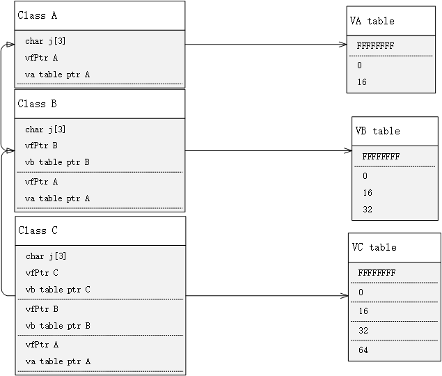

# 面向对象

类的基本思想是数据抽象（data abstruction）和封装（encapsulated），数据抽象是一种依赖接口（interface）和实现（implementation）分离的编程技术；

- 类的接口包括用户所执行的操作；
- 类的实现包括类的数据成员、负责接口的实现的函数体以及定义类所需要的各种私有函数；

面向对象必须提供对象、类和继承；对于一个空类，编译器默认产生4个成员函数：默认构造函数、默认析构函数、默认拷贝构造函数、默认赋值函数。

静态成员变量在同一个类中的所有实例间共享数据，如果想限制对静态成员变量的访问，必须把他们声明为保护型和私有型的，不允许用静态成员变量去存放某一个对象的数据；

析构函数可以为virtual型的，构造函数却不能，虚函数采用一种虚调用的方法，虚调用是一种可以在只有部分信息的情况下工作的机制，特别允许我们调用一个只知道接口而不知道其准确的对象类型的函数。但是如果要创建一个对象，必须要知道对象准确的类型，因此构造函数不能为虚函数；

每个虚函数的对象必须维护一个virtual
table，因此在使用虚函数的时候会产生一个系统的开销；如果仅是很小的类，且不需要派生类（子类），不需要虚函数；每个对象的虚表指针指向虚表，虚表存放虚函数的地址；虚函数表是顺序存放虚函数地址的，不需要用到链表；

## 1、构造函数

### 1.1构造函数初始化列表

```c++
class object {
public:
    /*object(int a, float b, int r) {
        this->a = a;
        this->b = b; // error 不能给const 赋值
        this->r = r; // 错误 r没被初始化
    }*/
    // 列表初始化
    object(int a, float b, int r) : a(a), b(b), r(r) {

    }

private:
    int a;
    const float b;
    int &r;
};
object obj(1, 2.2, 5);
```

如果成员是const、引用或者属于某种未提供默认构造函数的类类型，我们必须通过构造函数初始值列表为这些成员提供初值；

建议使用构造函数初始值，在类中初始化和赋值的区别事关底层效率问题：前者直接初始化数据成员，后置也是先初始化再赋值，一些数据成员必须被初始化；

### 1.2成员初始化的顺序

成员初始化的顺序和变量在类中出现的先后顺序一致，构造函数初始值列表中初始值的前后位置关系不会影响实际的初始化顺序；

```c++
class SalesData {
    friend std::istream &read(std::istream &is, SalesData &item);
    friend std::ostream &print(std::ostream &os, const SalesData &item);
    friend SalesData& add(const SalesData &lhs, const SalesData &rhs);
public:
    SalesData() = default;
    SalesData(std::string &bookNo) : bookNo(bookNo) {}
    SalesData(std::string bookNo, unsigned units_sold, double price) :
            bookNo(bookNo), units_sold(units_sold), revenue(units_sold * price) {}
    SalesData(std::istream &is);

    SalesData() : SalesData("", 0, 0) {} // 构造函数全部委托给另外一个构造函数
    SalesData(std::string &bookNo) : SalesData(bookNo, 0, 0) {}
    SalesData(std::istream &is)  : SalesData() { read(is, *this)};

    std::string isBookNo() const { return this->bookNo; }
    SalesData &combine(const SalesData &salesData);

private:
    std::string bookNo;
    unsigned units_sold = 0;
    double revenue = 0.0;
};

Sales_data first_item(cin);   // use Sales_data(std::istream &is) ; its value are up to your input.

int main() {
  	Sales_data next;  // use Sales_data(std::string s = ""); bookNo = "", cnt = 0, revenue = 0.0
  	Sales_data last("9-999-99999-9"); // use Sales_data(std::string s = ""); bookNo = "9-999-99999-9", cnt = 0, revenue = 0.0
}
```

当一个构造函数委托给另外一个构造函数时，受到委托的构造函数的初始值列表和函数体被依次执行，在Sales_data中，受委托的构造函数体恰好时空的，假如函数体包含有代码的话，将先执行这些代码，然后控制权才会交还给委托者的函数体；

### 1.3默认构造函数的作用

1、当对象被默认初始化或者值初始化时自动执行默认构造函数

- 在块作用域内不使用任何初始值定义一个非静态变量或者数组；

- 当一个类本身含有类类型的成员且使用合成的默认构造函数时；
- 当类类型的成员没有在构造函数初始值列表中显式地初始化时；

2、值初始化在以下情况发生

- 在数组初始化的过程中如果我们提供的初始值数量少于数组的大小时；
- 当我们不使用初始值定义一个局部静态变量时；
- 当我们通过书写形如T()的表达式显示地请求值初始化时，其中T是类型名；

```c++
Sales_data obj(); // 函数Sales_data obj(void)
Sales_data obj1; // 声明一个对象 调用默认的构造函数
```

### 1.4类隐式类型转化

```c++
item.combine(string("999-999"));//显示转化为string 隐式转化为Sales_data
item.combine(Sales_data("999-999"));//隐式转化为string 显示转化为Sales_data
item.combine("xxx-1156-9875"); // error 没有char*的 无法从char*转化为其他的类型
```

当我们使用explicit声明构造函数，它只能以直接初始化的形式使用，编译器不可以在自动转换过程中使用该构造函数；

## 2、拷贝构造函数

复制构造函数是一个构造函数，其第一个参数是对类类型的引用，任何其他参数都具有默认值。

当复制初始化发生时，该复制初始化需要复制构造函数或移动构造函数。

- 拷贝初始化发生在=定义变量时会发生;
- 将对象作为参数传递给非引用类型的参数;
- 从具有非引用返回类型的函数返回对象;
- 大括号：初始化数组中的元素或聚合类的成员;
- 某些类类型还为它们分配的对象使用复制初始化;

直接初始化：采用类中定义好的参数匹配的构造函数；

拷贝初始化：将右侧运算对象拷贝到正在创建的对象中，如果需要的话还要进行类型转换；

```c++
string dot(10, '0'); // 直接初始化
string s(dot); // 直接初始化
string s2 = dot; // 拷贝初始化
string null_books = "99999"; // 拷贝初始化
string nines = string(10, '0'); // 拷贝初始化
```

## 3、赋值构造函数

```C++
myClass(): data(i); // 带参数的构造函数， 冒号后面是成员变量初始化列表（member 			   					   // initializationlist）
```

## 4、友元

friend是类授予非公共成员访问权限的机制。他们享有与成员相同的权利。

优点：

- 有用的函数可以引用类作用域中的类成员，而无需显式地在它们前面加上类名。
- 方便地访问所有非公开成员。
- 有时，类的用户更容易阅读。

缺点：

- 减少封装，从而降低可维护性。
- 代码冗长，类内声明，类外声明。

## 5、继承和接口

### virtual

编译器处理虚函数的方法是给每个对象添加一个隐藏成员，隐藏成员中保存了一个指向函数地址数组的指针。这种数组被称为虚函数表（virtual function table vtbl），虚函数表中存储了为类对象进行声明的虚函数地址。例如
基类对象中包含一个指针，该指针指向基类中所有虚函数的地址表。派生类对象将包含一个指向独立地址表的指针。如果派生类提供了虚函数的新定义，该虚函数表将保存新函数的地址；如果派生类没有重新定义虚函数，该vtbl将保存函数原始版本的地址；如果派生类定义了新的虚函数，则该函数的地址也被添加到vtbl中，无论类中包含的虚函数是一个还是多个都只需要在对象中添加一个地址成员；

virtual
告诉编译器不应当完成早绑定，相反应当自动安装完成晚绑定所必需的所有的机制，编译器对每个包含虚函数的类创建一个表（vtable），编译器放置特定类的虚函数地址，每个带虚函数的类中，编译器秘密的设置一指针，成为vpointer（vptr），指向这个对象的vtable，通过基类指针作虚函数调用时（多态调用时），编译器静态地插入取得这个vptr，并且在vtable表中查找这个函数地址的代码，这样就能调用正确的函数使晚绑定发生；



虚指针或者虚函数指针式一个虚函数的实现细节，带有虚函数的类的每一个对象都有一个虚函数指针指向该类的虚函数表；

每个虚函数都在vtable中占了一个表项，保存着一条跳转到它的入口地址的指令（实际上式保存了他的入口地址），当一个包含虚函数的对象（不是对象的指针）被创建的时候，它在头部附加了一个指针，指向vtable中的相应位置，调用虚函数的时候，不管你是用什么指针调用的，它先根据vtable找到入口地址在执行，从而实现动态联编，而不像普通函数那样简单地跳转到一个固定的地址；

# c++额外开销

## 编译时开销

模板、类层次结构、强类型检查等新特性，以及使用这些新特征的c++模板、算法库都在明显增加c++编译器的负担；

## 运行时开销

### 虚基类

从直接虚继承的子类中访问虚基类的数据成员或其虚函数，将增加两次指针引用（大部分情况下可以优化为一次）和一次整型加法的时间开销。定义一个虚基类表，定义若干虚基类表指针的空间开销；

### 虚函数

虚函数的运行开销有进行整型加法和指针引用的时间开销。定义一个虚表，定义若干个（大部分情况下是一个）虚表指针的空间开销；

### RTTI(dynamic_cast和typeid)

RTTI,runtime type
information，运行时开销主要在进行整型比较和取址操作所增加的开销，定义一个type_info对象（包括类型ID和类名称）的空间开销。“dynamic_cast”用在类层次结构中漫游，对指针或者引用进行自由的向上、向下或者交叉转化。“typeid”则用于获取一个对象或者引用的准切类型。一般来说能使用虚函数解决不要使用dynamic_type,
能使用dynamic_type就不要使用typeid；

### 异常

在正常的情况下，try块的代码执行效率和普通的一样快，而且不需要使用传统上通过的返回值或者函数调用来判断错误的方式，代码的执行效率还会进一步提升，抛出和捕获异常的开销也只是在少数情况下会高于函数返回和函数调用的开销；

### 对象的构造和析构

不需要构造和析构的类型，没有很大的开销；对于那些需要初始化销毁的类型，有部分的开销；

# 重载运算符和重载函数

## 可重定义的运算符

| 运算符       | 名称                   | 类型   |
| :----------- | :--------------------- | :----- |
| **,**        | 逗号                   | 二进制 |
| **!**        | 逻辑非                 | 一元   |
| **!=**       | 不相等                 | 二进制 |
| **%**        | Modulus                | 二进制 |
| **%=**       | 取模赋值               | 二进制 |
| **&**        | 位与                   | 二进制 |
| **&**        | address-of             | 一元   |
| **&&**       | 逻辑与                 | 二进制 |
| **=**        | 按位“与”赋值           | 二进制 |
| **( )**      | 函数调用               | —      |
| **( )**      | 转换运算符             | 一元   |
| **`\*`**     | 乘法                   | 二进制 |
| **`\*`**     | 指针取消引用           | 一元   |
| **`\*=`**    | 乘法赋值               | 二进制 |
| **+**        | 加法                   | 二进制 |
| **+**        | 一元加                 | 一元   |
| **++**       | 递增 1                 | 一元   |
| **+=**       | 加法赋值               | 二进制 |
| **-**        | 减法                   | 二进制 |
| **-**        | 一元求反               | 一元   |
| **--**       | 减量 1                 | 一元   |
| **-=**       | 减法赋值               | 二进制 |
| **-**        | 成员选择               | 二进制 |
| **`->\*`**   | 指向成员的指针选定内容 | 二进制 |
| **/**        | 部门                   | 二进制 |
| **/=**       | 除法赋值               | 二进制 |
| **<**        | 小于                   | 二进制 |
| **<<**       | 左移                   | 二进制 |
| **=**        | 左移赋值               | 二进制 |
| **=**        | 小于或等于             | 二进制 |
| **=**        | 分配                   | 二进制 |
| **==**       | 相等                   | 二进制 |
| **>**        | 大于                   | 二进制 |
| **=**        | 大于等于               | 二进制 |
| **>>**       | 右移                   | 二进制 |
| **=**        | 右移赋值               | 二进制 |
| **[ ]**      | 数组下标               | —      |
| **^**        | 异或                   | 二进制 |
| **^=**       | 异或赋值               | 二进制 |
| **\|**       | 位或                   | 二进制 |
| **\|=**      | 按位“与或”赋值         | 二进制 |
| **\|\|**     | 逻辑或                 | 二进制 |
| **~**        | 二进制反码             | 一元   |
| **`delete`** | 删除                   | —      |
| **`new`**    | 新出现                 | —      |
| 转换运算符   | 转换运算符             | 一元   |

## 不可重定义的运算符

| 运算符   | 名称                   |
| :------- | :--------------------- |
| **.**    | 成员选择               |
| **`.*`** | 指向成员的指针选定内容 |
| **::**   | 范围解析               |
| **? :**  | 条件逻辑               |
| **#**    | 预处理器转换为字符串   |
| **##**   | 预处理器串联           |

尽管通常是在代码中遇到重载运算符时由编译器对其进行隐式调用，但也可以按照与调用任何成员或非成员函数相同的方式来显式调用重载运算符：

```cpp
Point pt;
pt.operator+( 3 );  // Call addition operator to add 3 to pt.
```

下面的示例重载 运算符 **+** 以添加两个复数并返回结果。

C++复制

```cpp
// operator_overloading.cpp
// compile with: /EHsc
#include <iostream>
using namespace std;

struct Complex {
   Complex( double r, double i ) : re(r), im(i) {}
   Complex operator+( Complex &other );
   void Display( ) {   cout << re << ", " << im << endl; }
private:
   double re, im;
};

// Operator overloaded using m_a member function
Complex Complex::operator+( Complex &other ) {
   return Complex( re + other.re, im + other.im );
}

int main() {
   Complex m_a = Complex( 1.2, 3.4 );
   Complex b = Complex( 5.6, 7.8 );
   Complex c = Complex( 0.0, 0.0 );
   c = m_a + b;
   c.Display();
}
```

最小函数 *声明* 包含返回类型、函数名称和参数列表 (可能为空) 以及向编译器提供其他指令的可选关键字。 以下示例是函数声明：

```cpp
int print(int m_a, int b);
```

函数定义由声明和 *正文*组成，正文是大括号之间的所有代码：

```cpp
int print(int m_a, int b)
{
    return m_a + b;
}
```

后接分号的函数声明可以出现在程序中的多个位置处。 它必须在每个翻译单元中对该函数的任何调用之前出现。 根据单个定义规则 (ODR)，函数定义必须仅在程序中出现一次。

函数声明的必需部分有：

1. 返回类型，指定函数返回的值的类型;如果未返回任何值， **`void`** 则返回类型。 在 C++11 中， 是有效的返回类型，指示编译器从 return **`auto`** 语句推断该类型。 在 C++14
   中， `decltype(auto)` 也是允许的。 有关详细信息，请参阅下面的“返回类型中的类型推导”。
2. 函数名，必须以字母或下划线开头，不能包含空格。 一般而言，标准库函数名中的前导下划线指示私有成员函数，或不是供你的代码使用的非成员函数。
3. 参数列表（一组用大括号限定、逗号分隔的零个或多个参数），指定类型以及可以用于在函数体内访问值的可选局部变量名。

函数声明的可选部分有：

1. **`constexpr`**，指示函数的返回值是常量值，可以在编译时进行计算。

   C++复制

    ```cpp
    constexpr float exp(float x, int n)
    {
        return n == 0 ? 1 :
            n % 2 == 0 ? exp(x * x, n / 2) :
            exp(x * x, (n - 1) / 2) * x;
    };
    ```

2. 其链接规范或 **`extern`****`static`** 。

   C++复制

    ```cpp
    //Declare printf with C linkage.
    extern "C" int printf( const char *fmt, ... );
    ```

   有关详细信息，请参阅翻译 [单元和链接](https://docs.microsoft.com/zh-cn/cpp/cpp/program-and-linkage-cpp?view=msvc-170)。

3. **`inline`**，指示编译器将函数的每次调用替换为函数代码本身。 在某个函数快速执行并且在性能关键代码段中重复调用的情况下，内联可以帮助提高性能。

   C++复制

    ```cpp
    inline double Account::GetBalance()
    {
        return balance;
    }
    ```

   有关详细信息，请参阅 [内联函数](https://docs.microsoft.com/zh-cn/cpp/cpp/inline-functions-cpp?view=msvc-170)。

4. 一 **`noexcept`** 个表达式，指定函数是否可以引发异常。 在下面的示例中，如果表达式计算结果为 ， `is_pod` 则函数不会引发异常 **`true`** 。

   C++复制

    ```cpp
    #include <type_traits>
    
    template <typename T>
    T copy_object(T& obj) noexcept(std::is_pod<T>) {...}
    ```

   有关详细信息，请参阅 [`noexcept`](https://docs.microsoft.com/zh-cn/cpp/cpp/noexcept-cpp?view=msvc-170)。

5. (成员函数) cv 限定符，该限定符指定函数是 **`const`** 还是 **`volatile`** 。

6. (成员函数) **`virtual`****`override`** 、 或 。 **`final`** **`virtual`** 指定可以在派生类中重写函数。 **`override`**
   表示派生类中的函数在重写虚函数。 **`final`** 表示函数不能在任何进一步的派生类中进行重写。
   有关详细信息，请参阅 [虚拟函数](https://docs.microsoft.com/zh-cn/cpp/cpp/virtual-functions?view=msvc-170)。

7. (成员函数) 成员函数意味着该函数不与类的任何对象 **`static`** 实例相关联。

8. (非静态成员函数仅) ref 限定符，它向编译器指定当隐式对象参数 () 是左值引用与左值引用时要选择的函数重载。 `*this`
   有关详细信息，请参阅 [函数重载](https://docs.microsoft.com/zh-cn/cpp/cpp/function-overloading?view=msvc-170#ref-qualifiers)。

const并不能代表“常量”，它仅仅是对变量的一个修饰，告诉编译器这个变量只能被初始化，且不能被直接修改（实际上可以通过堆栈溢出等方式修改）。而这个变量的值，可以在运行时也可以在编译时指定。

constexpr可以用来修饰变量、函数、构造函数。一旦以上任何元素被constexpr修饰，那么等于说是告诉编译器 “请大胆地将我看成编译时就能得出常量值的表达式去优化我”。

